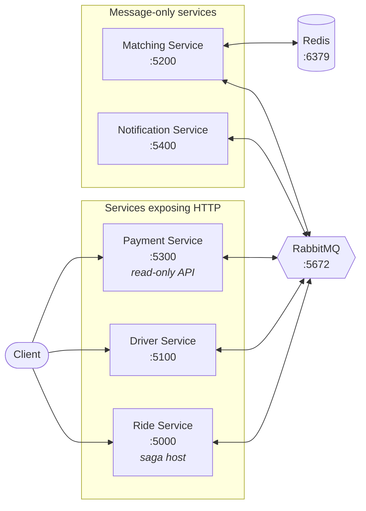

# ZM.RideSharingSystem

An event-driven ride-sharing backend built on **.NET 10**. Five autonomous microservices coordinate a ride from request to receipt over RabbitMQ, with a MassTransit saga owning the long-running workflow and Redis serving geospatial driver lookups.

Each service is a self-contained Clean Architecture / DDD stack — its own aggregate, its own database, its own copy of the shared primitives. The only thing services share is a message contract assembly.

---

## What this demonstrates

- **Saga orchestration** — a MassTransit state machine drives the six-step ride workflow across four services, correlating every message by `RideId`.
- **DDD aggregates** — private constructors, static `Create`/`Rehydrate` factories, invariants enforced in the entity, and domain events raised from behaviour rather than published by handlers.
- **Transactional outbox** — domain events are persisted in the same `SaveChanges` as the aggregate, then drained by a Quartz job behind a Polly retry pipeline.
- **Idempotent consumers** — a composite-key `ProcessedMessage` table makes redelivery safe.
- **CQRS-style use cases** — one folder per feature, MediatR `IRequestHandler` on the write side, dedicated query objects returning DTOs on the read side.
- **Redis geospatial matching** — driver availability as a Redis set, driver positions as a geo set, matched with `GEORADIUS`.
- **Persistence models decoupled from the domain** — rich aggregates with value objects on one side, flat storage rows on the other.
- **Result-based control flow** — a `Result`/`Error` envelope with per-service error catalogues instead of exceptions.
- **Convention-based DI** — Scrutor scans assemblies by type-name suffix, so a new repository or query is wired up by naming it correctly.
- **Service autonomy over reuse** — primitives are deliberately duplicated per service; only integration contracts are shared.

---

## System overview



| Service | Project | Responsibility | HTTP | Port |
|---|---|---|---|---|
| **Ride** | `ZM.RideService.Api` | Ride lifecycle, fare pricing, hosts the saga | Yes | 5000 |
| **Driver** | `ZM.DriverService.Api` | Driver registry, availability, location | Yes | 5100 |
| **Matching** | `ZM.MatchingService.Api` | Nearest-driver lookup via Redis GEO | No | 5200 |
| **Payment** | `ZM.PaymentService.Api` | Payment records | Read-only | 5300 |
| **Notification** | `ZM.NotificationService.Api` | Email / SMS / push dispatch | No | 5400 |
| **Contracts** | `ZM.RideSharingSystem.Contracts` | Shared integration messages | — | — |

Matching and Notification are message-only: their `Program.cs` registers the bus but never calls `MapCarter()`, because they are reached exclusively through RabbitMQ.

---

## Tech stack

| Concern | Choice |
|---|---|
| Runtime | .NET 10 (`net10.0`), nullable + implicit usings enabled |
| HTTP endpoints | Carter 10.0.0 (`ICarterModule`) |
| In-process dispatch | MediatR 14.1.0 |
| Messaging | MassTransit 9.1.2 + MassTransit.RabbitMQ 9.1.2 |
| Persistence | EF Core 10 — InMemory provider |
| Cache / geo index | StackExchange.Redis 3.0.11 (Matching only) |
| Scheduling | Quartz 3.18.1 + Quartz.Extensions.Hosting (Ride only) |
| Resilience | Polly 8.6.6 |
| DI scanning | Scrutor 7.0.0 |
| Serialization | Newtonsoft.Json 13.0.4 (outbox, `TypeNameHandling.All`) |
| API docs | Swashbuckle.AspNetCore 10.2.x + Microsoft.AspNetCore.OpenApi |
| Tests | xUnit 2.9.3, Moq 4.20.72, AutoFixture.AutoMoq 4.18.1, FluentAssertions 8.10.0 |

---

## Quick start

**Prerequisites:** .NET 10 SDK, Docker Desktop.

```bash
docker compose -f docker-compose.yml up --build
```

> Pass `-f docker-compose.yml` explicitly. `docker-compose.override.yml` is the Visual Studio-generated debug profile — it remaps the Ride service to container ports 8080/8081 and bind-mounts Windows `%APPDATA%` user-secret and HTTPS-certificate paths. Compose merges it automatically unless you name the base file, which would change the Ride service's ports away from the table below.

The APIs have no `depends_on` or healthchecks tying them to the broker, so bring the infrastructure up first if a service reports a connection failure on a cold start:

```bash
docker compose -f docker-compose.yml up -d mqbroker redis
docker compose -f docker-compose.yml up --build
```

| What | URL | Credentials |
|---|---|---|
| Ride API (Swagger) | http://localhost:5000/swagger | — |
| Driver API (Swagger) | http://localhost:5100/swagger | — |
| Matching (Swagger) | http://localhost:5200/swagger | — |
| Payment API (Swagger) | http://localhost:5300/swagger | — |
| Notification (Swagger) | http://localhost:5400/swagger | — |
| RabbitMQ management | http://localhost:15672 | `admin` / `admin` |
| RedisInsight | http://localhost:5540 | — |

The RabbitMQ management UI is the best window into the system — the exchanges and queues MassTransit creates map one-to-one onto the message contracts in [docs/messaging.md](docs/messaging.md).

### Running without Docker

```bash
dotnet run --project ZM.RideService.Api
```

| Service | HTTP | HTTPS |
|---|---|---|
| Ride | 5028 | 7131 |
| Driver | 5231 | 7109 |
| Matching | 5293 | 7062 |
| Payment | 5107 | 7271 |
| Notification | 5201 | 7289 |

Configuration defaults target the Compose network, so override two settings when running on the host — RabbitMQ and Redis still need to be reachable:

| Setting | Committed default | Host value |
|---|---|---|
| `MessageBroker:Host` | `amqp://distributedsys-mq:5672` | `amqp://localhost:5672` |
| `ConnectionStrings:Redis` *(Matching)* | `redis:6379` | `localhost:6379` |

---

## Build and test

```bash
dotnet build ZM.RideSharingSystem.slnx
dotnet test
```

The solution uses the XML `.slnx` format, which needs a recent SDK.

Tests are xUnit with Moq and AutoFixture. A custom `AutoMoqInlineDataAttribute` supplies auto-mocked dependencies and pins the clock to a fixed instant, and each test project keeps a `Builders/` folder (`RideBuilder`, `DriverBuilder`, `PaymentBuilder`, `AvailableDriverBuilder`) that constructs aggregates in a given state — `RideBuilder.BuildInProgress()`, for example — so a test names the state it cares about rather than replaying the transitions to reach it. Coverage centres on command handlers and the state guards they enforce.

---

## Repository layout

```
ZM.RideService.Api/            Ride lifecycle, pricing, saga, outbox
ZM.DriverService.Api/          Driver registry and availability
ZM.MatchingService.Api/        Redis-backed driver matching
ZM.PaymentService.Api/         Payment records
ZM.NotificationService.Api/    Email / SMS / push
ZM.RideSharingSystem.Contracts/  Shared message records
*.UnitTests/                   One test project per service
docker-compose.yml             Five services + RabbitMQ + Redis + RedisInsight
ZM.RideSharingSystem.slnx
```

The `src/`, `tests/` and `contracts/` folders in the `.slnx` are virtual solution folders — every project directory sits flat at the repository root.

Inside a service, the layering is uniform:

```
Domain/          Entities, ValueObjects, Enums, Events, Primitives, OperationResult, ErrorMessages
Application/     UseCases/<Feature>/, and the abstractions Infrastructure implements
Infrastructure/  Consumers, Extensions (DI), Sagas, BackgroundJobs, Pricing, Caches, Email/Sms/Push
Persistence/     DbContext, Configurations, Models, Repositories, UnitOfWorks, Queries, Outbox, Idempotence
Presentation/    Carter modules
```

---

## Documentation

| Page | What it covers |
|---|---|
| [Architecture](docs/architecture.md) | Layering and every pattern, with the file that implements it |
| [Ride lifecycle](docs/ride-lifecycle.md) | The saga end to end, plus the aggregate state machines |
| [Messaging](docs/messaging.md) | All 8 commands, 13 events, and 14 consumers |
| [API reference](docs/api-reference.md) | All 12 HTTP endpoints, with request bodies and a curl walkthrough |
| [Ride Service](docs/services/ride-service.md) | Ride aggregate, pricing, outbox, saga host |
| [Driver Service](docs/services/driver-service.md) | Driver aggregate, availability, location |
| [Matching Service](docs/services/matching-service.md) | Redis key design and the matching algorithm |
| [Payment Service](docs/services/payment-service.md) | Payment aggregate and read queries |
| [Notification Service](docs/services/notification-service.md) | Templates and the delivery-channel seam |

New to the codebase? Read [Ride lifecycle](docs/ride-lifecycle.md) first — following one ride through the system explains more than any single service page.
