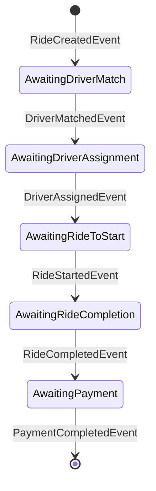
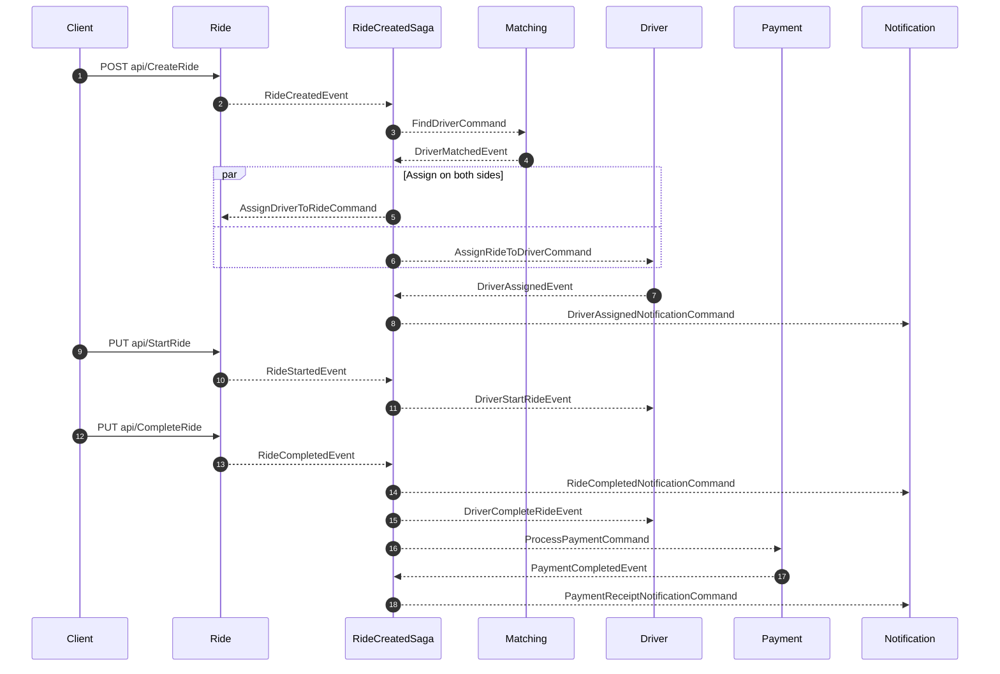
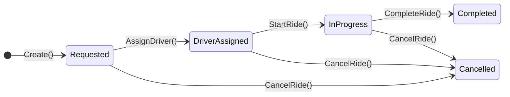
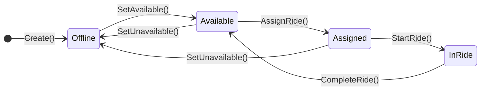

# Ride lifecycle

One ride, from request to receipt, across all five services. This is the best single entry point into the codebase.

- [The saga](#the-saga)
- [Message flow](#message-flow)
- [Step by step](#step-by-step)
- [Aggregate state machines](#aggregate-state-machines)
- [Driving it yourself](#driving-it-yourself)

---

## The saga

The workflow spans four services and outlives any single HTTP request, so it lives in an explicit state machine: `RideCreatedSaga` ([ZM.RideService.Api/Infrastructure/Sagas/RideCreated/RideCreatedSaga.cs](../ZM.RideService.Api/Infrastructure/Sagas/RideCreated/RideCreatedSaga.cs)).



Every state transition publishes the commands that drive the next step:

| State | On | Publishes | Next state |
|---|---|---|---|
| *Initial* | `RideCreatedEvent` | `FindDriverCommand` | `AwaitingDriverMatch` |
| `AwaitingDriverMatch` | `DriverMatchedEvent` | `AssignDriverToRideCommand`, `AssignRideToDriverCommand` | `AwaitingDriverAssignment` |
| `AwaitingDriverAssignment` | `DriverAssignedEvent` | `DriverAssignedNotificationCommand` | `AwaitingRideToStart` |
| `AwaitingRideToStart` | `RideStartedEvent` | `DriverStartRideEvent` | `AwaitingRideCompletion` |
| `AwaitingRideCompletion` | `RideCompletedEvent` | `RideCompletedNotificationCommand`, `DriverCompleteRideEvent`, `ProcessPaymentCommand` | `AwaitingPayment` |
| `AwaitingPayment` | `PaymentCompletedEvent` | `PaymentReceiptNotificationCommand` | `Finalize()` |

**Correlation.** All six events correlate on the ride's identifier:

```csharp
Event(() => RideCreated, x => x.CorrelateById(m => m.Message.RideId));
```

`RideId` doubles as the saga's `CorrelationId`, so concurrent rides never collide and any message can find its instance without a lookup table.

**Instance data.** `RideCreatedSagaData` carries only what later steps need: `CorrelationId`, `CurrentState`, `RideId`, `DriverId`, `RecipientEmail`. The e-mail address is captured from `RideCreatedEvent` at the very start and reused for every notification, so the saga never has to call back into the Ride service to ask who the rider is. `SetCompletedWhenFinalized()` removes the instance once the receipt goes out, rather than accumulating finished sagas.

**Notice what the saga does not do.** It never queries a service and never waits on a response. Each transition fires off commands and returns; the next event arrives whenever it arrives. That is what lets one slow service delay a ride without blocking anything else in the system.

---

## Message flow



---

## Step by step

### 1. Rider requests a ride

`POST api/CreateRide` reaches `CreateRideCommandHandler` ([Application/UseCases/CreateRide/CreateRideCommandHandler.cs](../ZM.RideService.Api/Application/UseCases/CreateRide/CreateRideCommandHandler.cs)), which:

1. Asks `IFareEstimator` for a quote from the pickup and destination coordinates.
2. Calls `Ride.Create(...)`, which sets `Status = Requested` and raises `RideCreatedDomainEvent`.
3. Persists through `IUnitOfWork`, which converts the raised event into an outbox row in the same save.

Within 5 seconds `ProcessOutboxMessagesJob` picks up the row and publishes it in-process, where `RideCreatedDomainEventHandler` translates the internal domain event into the public `RideCreatedEvent` and puts it on the bus:

```csharp
await _bus.Publish(new RideCreatedEvent(
    notification.RideId,
    notification.Latitude,
    notification.Longitude,
    notification.Rider.Email), cancellationToken);
```

That translation is the boundary between the service's internal language and its published contract. Domain events stay internal; integration events cross the wire.

### 2. Saga starts, matching begins

`RideCreatedEvent` creates the saga instance, which stores `RideId` and `RecipientEmail`, moves to `AwaitingDriverMatch`, and publishes `FindDriverCommand` carrying the pickup coordinates.

`FindDriverConsumer` in the Matching service receives it and re-shapes it into the service's internal command, wrapping the loose latitude/longitude into a `GeoLocation`:

```csharp
await _sender.Send(new Application.UseCases.FindDriver.FindDriverCommand(
    context.Message.RideId,
    new GeoLocation(context.Message.Latitude, context.Message.Longitude)));
```

`FindDriverCommandHandler` queries Redis for the nearest available driver within 10 km and publishes either `DriverMatchedEvent` or `DriverNotFoundEvent`. The Redis key design and the search itself are covered in [matching-service.md](services/matching-service.md).

### 3. Driver is assigned on both sides

A match makes the saga fan out two commands at once, because two aggregates each need to record the assignment in their own store:

- `AssignDriverToRideCommand` → Ride service — `Ride.AssignDriver(...)` sets `Status = DriverAssigned` and stamps `AssignedAtUtc`.
- `AssignRideToDriverCommand` → Driver service — `Driver.AssignRide(...)` sets `Status = Assigned` and records `CurrentRideId`.

The Driver service confirms with `DriverAssignedEvent`, raised from its own `RideAssignedDomainEvent` handler. The saga treats the driver's confirmation as the authoritative one — the driver is the constrained resource, so its acceptance is what advances the workflow — stores `DriverId`, and publishes `DriverAssignedNotificationCommand` for the rider's "driver on the way" e-mail.

### 4. Ride starts

`PUT api/StartRide` → `Ride.StartRide(...)` requires `Status == DriverAssigned`, sets `InProgress`, stamps `StartedAtUtc` (which the final fare depends on), and raises `RideStartedDomainEvent`. The saga responds with `DriverStartRideEvent`, moving the driver to `InRide`.

### 5. Ride completes

`PUT api/CompleteRide` → `CompleteRideCommandHandler` asks `IFareCalculator` for the actual fare, which adds a time component to the distance-based estimate, then `Ride.CompleteRide(actualFare, completedAtUtc)` sets `Completed`.

This is the saga's widest fan-out — three messages, in parallel, because nothing here depends on anything else here:

| Message | Destination | Effect |
|---|---|---|
| `RideCompletedNotificationCommand` | Notification | "Your ride is complete" e-mail |
| `DriverCompleteRideEvent` | Driver | Clears `CurrentRideId`, returns driver to `Available` |
| `ProcessPaymentCommand` | Payment | Settles the fare |

Returning the driver to `Available` re-publishes them into the Redis index, making them matchable for the next ride.

### 6. Payment and receipt

The Payment service creates a `Payment`, completes it, and raises `PaymentCompletedDomainEvent`, which surfaces as `PaymentCompletedEvent`. The saga publishes `PaymentReceiptNotificationCommand` and calls `Finalize()`, ending the instance.

---

## Aggregate state machines

The saga coordinates; the aggregates enforce. Each guards its own transitions independently, so an out-of-order message is rejected by the aggregate rather than corrupting it.

### Ride



| Method | Requires | Otherwise |
|---|---|---|
| `AssignDriver` | `Requested` | `RIDE0002` |
| `StartRide` | `DriverAssigned` | `RIDE0003` |
| `CompleteRide` | `InProgress` | `RIDE0004` |
| `CancelRide` | not `Completed` | `RIDE0005` |

`RideStatus` is explicitly numbered (`Requested = 1` … `Cancelled = 6`) so the stored integers stay stable as members are added. `DriverArrived = 3` is declared as a slot for the driver-arrival step and is not currently set by any transition.

Cancellation is the one deliberately permissive transition: a ride can be cancelled from any state except `Completed`, since a rider abandoning a ride is not an error condition.

### Driver



| Method | Requires | Otherwise |
|---|---|---|
| `SetAvailable` | not `InRide` | `DRIVER0002` |
| `SetUnavailable` | not `InRide` | `DRIVER0002` |
| `AssignRide` | `Available` | `DRIVER0003` |
| `StartRide` | `Assigned` | `DRIVER0004` |
| `CompleteRide` | `InRide` | `DRIVER0005` |

Two details worth noting:

- **`SetAvailable` is idempotent.** A driver already `Available` returns `Result.Success()` without raising events, so a repeated availability ping does not flood the bus with redundant `DriverAvailableEvent` messages.
- **`UpdateLocation` has no guard.** Position is a fact about the world, not a state transition, so it always succeeds and always raises `DriverLocationUpdatedDomainEvent`. Whether that ping reaches the matching index is decided downstream, in Redis, by whether the driver is currently available.

`CompleteRide` returns the driver to `Available` rather than `Offline` — finishing a ride keeps them on shift.

---

## Driving it yourself

Order matters: **a ride can only be matched if a driver is already available**, because `SetDriverAvailable` is what puts a driver into the Redis geo index.

1. `POST api/RegisterDriver` on :5100 — the driver starts `Offline`.
2. `PUT api/SetDriverAvailable` with coordinates near your intended pickup point — this publishes `DriverAvailableEvent` and `DriverLocationUpdatedEvent`, which is what populates the index. Matching searches a 10 km radius, so keep the pickup within that.
3. `POST api/CreateRide` on :5000 — steps 1–3 above run on their own.
4. `GET api/GetRides` to read back the assigned `driverId`, or watch the queues in the RabbitMQ management UI at http://localhost:15672.
5. `PUT api/StartRide`, then `PUT api/CompleteRide`.
6. `GET api/GetPaymentByRideId/{rideId}` on :5300.

Full request bodies are in [api-reference.md](api-reference.md), which ends with this same sequence as runnable curl commands.
