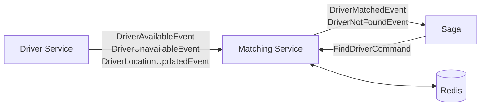

# Matching Service

`ZM.MatchingService.Api` — port **5200** (local: 5293 / 7062)

Answers one question: *which available driver is nearest to this pickup point?*

It is the architectural outlier — no aggregate, no EF Core, no HTTP endpoints. State lives entirely in Redis, and the service is reached only through RabbitMQ. That makes it the one service that can be scaled horizontally without coordination.

- [Why it is different](#why-it-is-different)
- [Read models](#read-models)
- [Redis key design](#redis-key-design)
- [The cache](#the-cache)
- [Matching](#matching)
- [Consumers](#consumers)
- [Use cases](#use-cases)
- [Configuration](#configuration)
- [Tests](#tests)

---

## Why it is different

Driver matching is a spatial query over data that changes constantly and matters only right now. A relational store is the wrong shape for it: every driver emits position updates continuously, and yesterday's positions have no value.

So this service holds no durable state of its own. It maintains a **projection** of driver availability, rebuilt from the events the Driver service publishes, in a store built for geospatial lookup. If Redis is lost, the index refills as drivers ping — nothing authoritative is gone, because the Driver service owns the truth.

That is also why it has no HTTP surface. There is no resource to expose. It consumes four messages and publishes two.



---

## Read models

`Domain/Models/` and `Domain/ValueObjects/` — records, not entities. Nothing here has behaviour or invariants, because this service makes no decisions about driver state.

```csharp
public record AvailableDriver(Guid DriverId, double? Latitude, double? Longitude, DateTime LastLocationUpdateAtUtc)
{
    public bool HasLocation => Latitude.HasValue && Longitude.HasValue;
}
```

```csharp
public record GeoLocation(double Latitude, double Longitude, string? Address = null);
```

`GeoLocation` is the service's own coordinate type. Transport messages carry loose `double Latitude, double Longitude`; `FindDriverConsumer` wraps them into `GeoLocation` on the way in, so nothing past the boundary handles a bare pair of doubles that could be swapped by accident.

---

## Redis key design

Three keys, each doing one job:

| Key | Type | Contents |
|---|---|---|
| `drivers:available` | Set | Driver ids currently on shift and unassigned |
| `drivers:geo` | Geo set | Driver id → longitude/latitude |
| `driver:{guid}` | Hash | Per-driver metadata (`LastLocationUpdateAtUtc`) |

```csharp
private const string AvailableDriversSetKey = "drivers:available";
private const string DriversGeoKey = "drivers:geo";
private const string DriverMetadataPrefix = "driver:";
```

**Why availability and position are separate.** They change independently and at very different rates. A driver pings position every few seconds while their availability changes a handful of times a shift. Keeping them apart means a position update is a single `GEOADD` that never touches the availability set, and going offline is a set removal that never rewrites coordinates.

It also makes removal from matching a one-key operation. A driver taken out of `drivers:available` stops being matched immediately, whatever `drivers:geo` still holds — which is why the search intersects the two rather than trusting the geo set alone.

You can inspect all three live in RedisInsight at http://localhost:5540.

---

## The cache

[Infrastructure/Caches/RedisDriverMatchingCache.cs](../../ZM.MatchingService.Api/Infrastructure/Caches/RedisDriverMatchingCache.cs) implements `IAvailableDriverCache`:

| Method | Redis operations |
|---|---|
| `AddAvailableDriverAsync` | `SADD drivers:available` |
| `RemoveDriverAsync` | `SREM` + `ZREM` (geo) + `DEL driver:{id}` |
| `UpdateDriverLocationAsync` | `SISMEMBER` guard → `GEOADD` + `HSET` |
| `GetNearestDriverAsync` | `GEORADIUS`, then `SISMEMBER` per candidate |

`RemoveDriverAsync` clears all three keys, leaving nothing behind for a stale entry to be matched from.

`UpdateDriverLocationAsync` opens with a membership check and returns early if it fails:

```csharp
if (!await _database.SetContainsAsync(AvailableDriversSetKey, member))
{
    return;
}
```

Position pings from drivers who are offline or already in a ride are therefore discarded rather than indexed. The Driver service publishes every ping unconditionally — it has no reason to know who is matchable — and the filtering happens here, at the only place that cares. The geo set stays exactly as large as the pool of matchable drivers.

---

## Matching

`GetNearestDriverAsync`:

```csharp
var drivers = await _database.GeoRadiusAsync(
    DriversGeoKey,
    pickupLocation.Longitude,
    pickupLocation.Latitude,
    10,
    GeoUnit.Kilometers,
    order: Order.Ascending);

foreach (var driver in drivers)
{
    var member = driver.Member.ToString();

    if (!await _database.SetContainsAsync(AvailableDriversSetKey, member))
    {
        continue;
    }

    // ... first available candidate wins
}
```

**The rule: the nearest available driver within 10 km.**

- `GEORADIUS` with `Order.Ascending` returns candidates nearest-first, so the first acceptable hit is the answer — no sorting, no scanning the rest.
- Each candidate is re-checked against `drivers:available` before being accepted. The geo set can hold a driver who has since been assigned; the availability set is the authority, and this check is what makes the two-key design safe.
- No match inside 10 km returns `null`.

Argument order is worth noting: Redis geo commands take **longitude first**, the opposite of the latitude-first convention used everywhere else in this codebase.

Ranking is purely by distance. Driver rating, vehicle class, acceptance rate, ETA over the road network, fairness across drivers and surge conditions are all absent — the seam for any of them is this method, behind `IAvailableDriverCache`.

---

## Consumers

`Infrastructure/Consumers/`

| Consumer | Consumes | Effect |
|---|---|---|
| `DriverAvailableConsumer` | `DriverAvailableEvent` | Adds to `drivers:available` |
| `DriverUnavailableConsumer` | `DriverUnavailableEvent` | Clears all three keys |
| `DriverLocationUpdatedConsumer` | `DriverLocationUpdatedEvent` | Updates position, if available |
| `FindDriverConsumer` | `FindDriverCommand` | Runs the search |

These are the only consumers in the system without a `ProcessedMessages` idempotency check — and they do not need one. Every operation here is naturally idempotent: `SADD` of an existing member, `GEOADD` of an unchanged position, and `SREM` of an absent member all converge on the same state however many times they run. Replay is harmless by construction rather than by bookkeeping.

`FindDriverConsumer` shows the translation at the boundary:

```csharp
await _sender.Send(new Application.UseCases.FindDriver.FindDriverCommand(
    context.Message.RideId,
    new GeoLocation(context.Message.Latitude, context.Message.Longitude)));
```

The internal command shares its name with the contract, so the internal one is fully qualified — the type a consumer binds to determines its queue.

---

## Use cases

| Use case | Handler | Result |
|---|---|---|
| AddAvailableDriver | `AddAvailableDriverCommandHandler` | Driver enters the pool |
| RemoveAvailableDriver | `RemoveAvailableDriverCommandHandler` | Driver leaves the pool |
| UpdateDriverLocation | `UpdateDriverLocationCommandHandler` | Position refreshed |
| FindDriver | `FindDriverCommandHandler` | Publishes match or no-match |

`FindDriverCommandHandler` ([Application/UseCases/FindDriver/FindDriverCommandHandler.cs](../../ZM.MatchingService.Api/Application/UseCases/FindDriver/FindDriverCommandHandler.cs)):

```csharp
var matchedDriver = await _availableDriverCache.GetNearestDriverAsync(request.PickupLocation, cancellationToken);

if (matchedDriver is null)
{
    await _publishEndpoint.Publish(new DriverNotFoundEvent(request.RideId), cancellationToken);
    return Result.Success();
}

await _publishEndpoint.Publish(new DriverMatchedEvent(request.RideId, matchedDriver.DriverId), cancellationToken);
return Result.Success();
```

Both branches return `Result.Success()` — the *search* succeeded either way. "No driver nearby" is a business outcome announced as `DriverNotFoundEvent`, not a failure of the operation. Modelling it as an explicit event rather than silence gives the workflow something concrete to react to, and distinguishes "nobody is available" from "the matching service never answered".

---

## Configuration

```json
{
  "MessageBroker": {
    "Host": "amqp://distributedsys-mq:5672",
    "Username": "admin",
    "Password": "admin"
  },
  "ConnectionStrings": {
    "Redis": "redis:6379"
  }
}
```

The only service with a Redis connection string. `IConnectionMultiplexer` is registered as a **singleton** — it is designed to be shared and multiplexes concurrent commands over one connection, so creating one per request would be a performance mistake:

```csharp
services.AddSingleton<IConnectionMultiplexer>(_ =>
    ConnectionMultiplexer.Connect(configuration.GetConnectionString("Redis")!));

services.AddScoped<IAvailableDriverCache, RedisDriverMatchingCache>();
```

`Program.cs` registers Swagger and runs, but never calls `MapCarter()` — there are no routes to map.

---

## Tests

`ZM.MatchingService.Api.UnitTests`

| Test file | Cases |
|---|---|
| `AddAvailableDriverCommandHandlerTests` | Adds a driver |
| `RemoveAvailableDriverCommandHandlerTests` | Removes a driver |
| `UpdateDriverLocationCommandHandlerTests` | Updates position |
| `FindDriverCommandHandlerTests` | Publishes `DriverMatchedEvent`; publishes `DriverNotFoundEvent` |

`AvailableDriverBuilder` defaults to Belgrade (44.7866, 20.4489). Tests mock `IAvailableDriverCache`, so they verify the handler's branching rather than Redis itself — exercising the `GEORADIUS` behaviour would need a real or embedded Redis instance.
